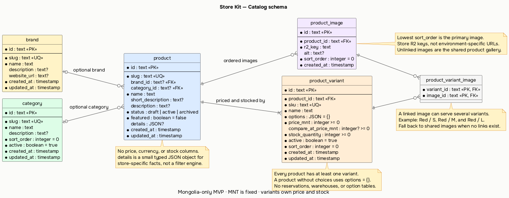

# Build the catalog foundation

## Objective

Add the first real commerce domain to Store Kit: a small product catalog that supports Plugged and later stores.

This plan must deliver:

- the final MVP catalog schema
- D1 migrations
- Drizzle relations and generated TypeBox schemas
- storefront catalog queries and commerce operations
- serialized Better Result routes through Elysia and Eden
- named TanStack Solid Query option factories that use `useQuery`
- a reusable, validated Plugged seed/import flow
- real local D1 verification without mocks or stubs

Do not build the custom Plugged storefront, cart, checkout, admin product editor, authentication, payments, Telegram integration, discounts, or deployment automation in this plan.

## Constraints

- Keep the schema small and store-independent.
- Use direct, procedural code. Do not add repositories, controllers, class-based services, or dependency-injection containers.
- Do not build an enterprise product attribute or inventory system.
- Do not duplicate price, currency, or stock state.
- `MNT` remains a platform constant. Do not add a currency column.
- Product variants are the only source for price and stock.
- A product without choices still has one default variant.
- Do not add stock reservations, an inventory ledger, warehouses, or events.
- Use plain tagged Result errors. Do not add client error classes or route-specific error translations.
- Tests must use the real implementation and a real local D1 database. Never add mocks, stubs, fake implementations, or placeholder assertions.
- Do not use `as any`.
- Add only files and dependencies that this catalog slice uses.

## Proposed schema

Diagram source: [`docs/diagrams/catalog-schema.puml`](../docs/diagrams/catalog-schema.puml)

Rendered diagram: [`docs/diagrams/catalog-schema.png`](../docs/diagrams/catalog-schema.png)



Use six catalog tables. All IDs are text IDs generated by the application with `crypto.randomUUID()`.

### `brand`

Brands are useful for reseller storefronts such as Plugged and remain simple enough for general stores.

| Column | Type | Rules |
| --- | --- | --- |
| `id` | text | primary key |
| `slug` | text | required, unique |
| `name` | text | required |
| `description` | text | optional |
| `website_url` | text | optional |
| `created_at` | integer timestamp | required |
| `updated_at` | integer timestamp | required |

Do not add brand-specific product logic or a separate brand content system.

### `category`

Categories are flat during the MVP.

| Column | Type | Rules |
| --- | --- | --- |
| `id` | text | primary key |
| `slug` | text | required, unique |
| `name` | text | required |
| `description` | text | optional |
| `sort_order` | integer | required, defaults to `0` |
| `active` | integer boolean | required, defaults to `true` |
| `created_at` | integer timestamp | required |
| `updated_at` | integer timestamp | required |

Do not add parent categories, category trees, tags, or collection rules yet.

### `product`

| Column | Type | Rules |
| --- | --- | --- |
| `id` | text | primary key |
| `slug` | text | required, unique |
| `brand_id` | text | optional foreign key to `brand.id`, set null on brand deletion |
| `category_id` | text | optional foreign key to `category.id`, set null on category deletion |
| `name` | text | required |
| `short_description` | text | optional |
| `description` | text | optional |
| `status` | text | `draft`, `active`, or `archived`; defaults to `draft` |
| `featured` | integer boolean | required, defaults to `false` |
| `details` | JSON text | optional, small store-specific product facts |
| `created_at` | integer timestamp | required |
| `updated_at` | integer timestamp | required |

Use this narrow JSON type for `details`:

```ts
export type ProductDetailValue = string | number | boolean | string[];
export type ProductDetails = Record<string, ProductDetailValue>;
```

`details` replaces a Plugged-specific `iem_spec` table. It can hold facts such as driver type, impedance, connector, or sound signature without putting IEM concepts into the shared schema. Do not filter or sort on arbitrary `details` values during the MVP.

Do not add base price, compare-at price, currency, stock, old slugs, SEO tables, or storefront layout data to `product`.

Each product has at most one category during the MVP. Do not add a `product_category` join table unless a real store later needs one product in several genuine categories.

### `product_image`

| Column | Type | Rules |
| --- | --- | --- |
| `id` | text | primary key |
| `product_id` | text | foreign key to `product.id`, cascade on delete |
| `r2_key` | text | required |
| `alt` | text | optional |
| `sort_order` | integer | required, defaults to `0` |
| `created_at` | integer timestamp | required |

The lowest `sort_order` is the primary image. Do not add a second `is_primary` source of truth. Use a unique index on `(product_id, sort_order)`.

Store R2 object keys, not environment-specific public URLs. URL construction belongs to a shared media helper or media route, not the database.

### `product_variant`

| Column | Type | Rules |
| --- | --- | --- |
| `id` | text | primary key |
| `product_id` | text | foreign key to `product.id`, cascade on delete |
| `sku` | text | required, unique |
| `name` | text | required |
| `options` | JSON text | required, defaults to `{}` |
| `price_mnt` | integer | required, non-negative |
| `compare_at_price_mnt` | integer | optional, non-negative |
| `stock_quantity` | integer | required, non-negative, defaults to `0` |
| `active` | integer boolean | required, defaults to `true` |
| `sort_order` | integer | required, defaults to `0` |
| `created_at` | integer timestamp | required |
| `updated_at` | integer timestamp | required |

Use this option type:

```ts
export type VariantOptions = Record<string, string>;
```

Examples:

```ts
{}
{ size: "M", color: "Black" }
{ connector: "USB-C" }
```

A product with no customer-selectable options still gets one variant with `{}`. This keeps price, stock, order lines, and later cart behavior uniform.

Do not create option, option-value, inventory, reservation, or warehouse tables.

### `product_variant_image`

This join table lets different variants use different images without duplicating image records. One red-shirt image can belong to the red small, medium, and large variants.

| Column | Type | Rules |
| --- | --- | --- |
| `variant_id` | text | foreign key to `product_variant.id`, cascade on delete |
| `image_id` | text | foreign key to `product_image.id`, cascade on delete |

Use a composite primary key on `(variant_id, image_id)`. An image with no variant links belongs to the shared product gallery.

Storefront behavior:

1. Show images linked to the selected variant.
2. If the selected variant has no linked images, show the shared product gallery.
3. Keep image order from `product_image.sort_order`.

Do not add image copies for every size or encode color names into image columns.

## Relationships

```text
brand 1 ─────── 0..* product *..0 ─────── 1 category
                       │
                       ├── 1..* product_variant
                       ├── 0..* product_image
                       └── product_variant *..* product_image
                           through product_variant_image
```

Deletion behavior:

- deleting a product cascades to its variants and images
- deleting a category sets `product.category_id` to null
- deleting a brand sets `product.brand_id` to null
- deleting a variant or image cascades to its variant-image links
- normal product removal uses `archived`; destructive deletion is not part of the storefront API

## Database implementation

Add catalog files under `packages/db/src/catalog`:

```text
packages/db/src/
├─ client.ts
├─ schema/
│  └─ catalog.ts
├─ relations/
│  └─ catalog.ts
├─ schemas/
│  └─ catalog.ts
└─ queries/
   └─ catalog.ts
```

Keep this structure shallow. If a file remains small, do not split it further.

### Drizzle schema

Use `sqliteTable`, foreign keys, unique indexes, useful filter indexes, and database checks for real invariants:

- valid product status
- non-negative variant price
- non-negative compare-at price when present
- non-negative stock quantity

Do not add indexes without a query in this plan.

### Generated TypeBox schemas

Generate base schemas with:

```ts
import {
  createInsertSchema,
  createSelectSchema,
  createUpdateSchema,
} from "drizzle-orm/typebox";
```

Refine the generated schemas only where the database type is not enough, such as slugs, URLs, JSON option values, and public list filters.

Infer exported TypeScript types from the tables and schemas. Do not maintain duplicate interfaces.

### Migrations

Add `packages/db/drizzle.config.ts` and commit the generated SQL migration.

Provide workspace tasks for:

- generate migration
- apply migrations to Plugged local D1
- apply migrations to a remote Plugged D1 only when explicitly requested

Do not create Cloudflare resources in this plan.

## Database queries

Add direct database functions in `packages/db/src/queries/catalog.ts`.

### `listPublishedProducts`

Inputs:

```ts
{
  category?: string;
  brand?: string;
  featured?: boolean;
  query?: string;
  limit?: number;
  offset?: number;
}
```

Behavior:

- include only `product.status = "active"`
- include only active variants
- include the brand, category, ordered images, ordered variants, and variant-image links
- filter category and brand by slug
- use a simple case-insensitive name, description, and brand-name search
- order featured products first, then newest products
- default to 24 items
- cap the public limit at 100
- return items and a total count

Do not add a search service, relevance engine, cursor abstraction, or generic filter builder.

### `findPublishedProductBySlug`

Behavior:

- find one active product by exact slug
- include its brand, active category, ordered images, ordered active variants, and variant-image links
- return `undefined` when no published product exists

### `listPublishedCategories`

Return active categories in `sort_order`, then name order. Category counts are not required in this plan.

### `listBrands`

Return brands that have at least one active product. Order by name.

Keep query result types inferred from Drizzle.

## Commerce operations

Add `packages/commerce/src/catalog/operations.ts` and `errors.ts`.

### Product list

`listCatalogProducts(filters)` validates normalized filters, calls `listPublishedProducts`, and returns `Result.ok`.

Do not invent expected failure variants for a list that has no expected failure.

### Product detail

`getCatalogProduct(slug)` returns:

```ts
Result<ProductDetail, ProductNotFound>
```

Use this plain error:

```ts
type ProductNotFound = {
  _tag: "ProductNotFound";
  message: string;
  slug: string;
};
```

### Taxonomy lists

Add direct operations for published categories and brands only if they add validation or response shaping. Otherwise, let the route call the catalog operation module's small exported functions. Do not add pass-through layers only to satisfy a pattern.

## API routes

Add `packages/api/src/routes/catalog.ts` and mount it in the existing Elysia app.

### `GET /api/products`

Accept validated query parameters:

- `category`
- `brand`
- `featured`
- `query`
- `limit`
- `offset`

Return a serialized Better Result containing:

```ts
{
  items: ProductSummary[];
  total: number;
  limit: number;
  offset: number;
}
```

### `GET /api/products/:slug`

Return `Result.serialize(await getCatalogProduct(slug))`.

A missing product remains a resolved serialized `Result.err`. Do not convert it into a custom client error class or handwritten API error envelope.

### `GET /api/categories`

Return active categories.

### `GET /api/brands`

Return brands with active products.

Use Elysia and Eden inference. Do not add handwritten client DTOs when route inference already provides the type.

## Storefront query options

Add named exports under `packages/storefront/src/query-options`:

```ts
export const productListOptions = (filters: ProductListFilters) => queryOptions({ ... });
export const productDetailOptions = (slug: string) => queryOptions({ ... });
export const categoryListOptions = () => queryOptions({ ... });
export const brandListOptions = () => queryOptions({ ... });
```

Requirements:

- use stable query keys made only from normalized serializable inputs
- call Eden directly
- throw only Eden transport or unexpected HTTP failures
- deserialize Better Results before returning
- keep `Result.err` as TanStack Query data
- use TanStack Solid Query's `useQuery` syntax in any proof component
- do not create a global nested query object

Do not build the final product UI in this plan. A plain proof section can show the item count and one product slug, then be removed when the custom Plugged storefront plan starts.

## Plugged seed and import

Do not scrape the old Plugged site or database.

Create one normalized seed source owned by `apps/plugged`, for example:

```text
apps/plugged/data/catalog.seed.json
```

The seed format contains:

- brands
- categories
- products with an optional category slug
- variants with option maps
- local image source paths and target R2 keys
- image keys linked to each variant when variants have different images
- Plugged-specific product details

Add a small command in `@store-kit/tooling` that:

1. reads the seed JSON
2. validates it with shared TypeBox input schemas
3. uploads referenced local image files to the Plugged R2 bucket
4. applies deterministic catalog inserts or updates to D1
5. prints counts for brands, categories, products, variants, images, and variant-image links

Default the command to local Cloudflare resources. Require an explicit flag for remote resources. Use Wrangler's supported D1 and R2 commands instead of opening Wrangler's internal SQLite files.

The command must be safe to run again for the same seed IDs and slugs. This is needed for normal development, not as a general import framework.

Do not build CSV mapping screens, a plugin system, scraping infrastructure, import jobs, queues, or rollback orchestration.

Import useful Plugged catalog data only after the schema and validation pass. Do not copy old auth, cart, order, payment, analytics, or search code.

## Real verification

Use real local Cloudflare resources.

Minimum verification:

1. apply the committed migration to local D1
2. run the Plugged catalog seed against local D1 and local R2
3. run the seed a second time and confirm counts do not duplicate
4. start Astro through the required background command
5. request `/api/products`
6. request one valid `/api/products/:slug`
7. request one missing slug and confirm a serialized `ProductNotFound` Result
8. confirm category and brand filters return expected seeded products
9. confirm a variant with linked images returns those links and another variant falls back to shared images
10. confirm inactive products and variants are absent
11. confirm the browser bundle does not include Drizzle, D1, or `cloudflare:workers`

Add a test file only if it runs against real local D1. Prefer a focused workerd integration test or runtime smoke check over a mocked query unit test.

Run:

```sh
vp install
vp check
vp test
vp run -r build
vp run @store-kit/plugged#generate-types
```

Also run the new migration and seed tasks.

## Implementation sequence

1. Add the six Drizzle tables, relations, and real invariant checks.
2. Add generated TypeBox schemas and inferred types.
3. Generate and inspect the D1 migration.
4. Apply the migration to Plugged local D1.
5. Add the four concrete catalog queries.
6. Add the catalog commerce operations and `ProductNotFound` union.
7. Add and mount the four Elysia routes.
8. Add Eden Result deserialization and named query-option factories.
9. Add the normalized Plugged seed source and the small idempotent seed command.
10. Import only Plugged catalog data and product media.
11. Add a plain temporary catalog proof to the Plugged foundation page.
12. Run real local D1, R2, API, bundle, test, lint, type, and build validation.

## Out of scope

Do not implement:

- custom storefront design
- product creation or editing UI
- customer carts
- checkout or orders
- stock decrement or restoration workflows
- authentication
- QPay or bank transfer
- Telegram notifications
- discounts or coupons
- reviews or ratings
- wishlists
- category trees
- tags or automated collections
- option-definition tables
- inventory reservations or ledgers
- search indexing
- general import frameworks
- Cloudflare resource provisioning

## Completion criteria

The catalog foundation is complete when:

- the proposed six-table schema is migrated to local D1
- variants are the only price and stock source
- every seeded product has at least one variant
- one product category uses the direct nullable `product.category_id` foreign key
- variant-specific images use `product_variant_image` and shared images need no links
- Plugged seed data and images load through an idempotent command
- published list, detail, category, and brand routes work in workerd
- a missing slug is a deserialized `ProductNotFound` Result in query data
- named query options infer their data from Eden
- all verification commands pass
- no mock or stub test exists
- no out-of-scope store feature was added
